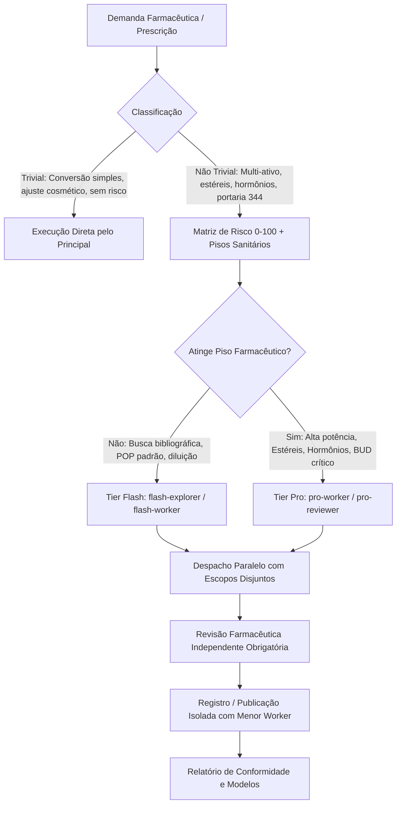

# Pharmaceutical AI Agent Framework v1

Framework de governança e roteamento de agentes de IA para engenharia e desenvolvimento no setor farmacêutico magistral, industrial e clínico. A v1 estabelece critérios objetivos para que o agente principal classifique cada solicitação, estime complexidade e risco sanitário/farmacotécnico e delegue cada unidade ao menor agente capaz de executá-la com segurança.

O repositório distribui uma implementação nativa para **Codex** e adaptações por projeto para **Gemini CLI (Google Antigravity)**, **Claude Code** e **Cursor**, incorporando as regulamentações sanitárias brasileiras (**ANVISA RDC 67/2007**, **Portaria SVS/MS nº 344/98**, **Farmacopeia Brasileira 6ª Edição** e resoluções do **CFF** e **CFM**).



## Pacotes Disponíveis

| Pacote | Plataforma | Instalação Suportada | Mapeamento de Modelos |
| --- | --- | --- | --- |
| [gemini-cli-global-framework-v1](gemini-cli-global-framework-v1/) | Gemini CLI / Antigravity | Por projeto ou Global ($HOME) | Flash e Pro |
| [claude-code-global-framework-v1](claude-code-global-framework-v1/) | Claude Code | Por projeto ou Global ($HOME) | Haiku, Sonnet e Opus |
| [cursor-global-framework-v1](cursor-global-framework-v1/) | Cursor | Por projeto ou Global ($HOME) | Composer, Sonnet e Opus |
| [codex-global-framework-v1](codex-global-framework-v1/) | Codex | Global (padrão) ou Por projeto | Luna, Terra e Sol |

Os quatro arquivos `.zip` na raiz do projeto são artefatos versionados e contêm as respectivas distribuições prontas para transporte e extração rápida.

## Especialistas Farmacêuticos Opcionais

O repositório fornece especialistas de domínio farmacêutico opcionais, empacotados como Skills modulares (arquitetura padrão de 7 arquivos):

1. **`pd-farmacotecnico-specialist` (Desenvolvimento Farmacotécnico e P&D Magistral)**:
   - Assistente sênior de IA parceira da farmacêutica Responsável Técnica (RT).
   - Avaliação físico-química (pKa, solubilidade, pH de estabilidade, polimorfismo, degradação).
   - Cálculos magistrais críticos: fator de correção ($F_{cor}$), equivalência sal/base, densidade aparente e escolha de cápsulas sem sobrequantidade arbitrária.
   - Resposta estruturada obrigatória em **8 seções** (Objetivo, Viabilidade, Proposta, Processo, Testes/Controles, Embalagem/Estabilidade, Conclusão, Referências).
   - Diferenciação epistemológica estrita: (1) Confirmado por fonte oficial; (2) Inferência farmacotécnica fundamentada; (3) Hipótese que exige teste de bancada; (4) Dado desconhecido.

2. **`visitacao-medica-specialist` (Especialista Sênior em Visitação Médica Magistral)**:
   - Propaganda médica e relacionamento técnico de alto nível com prescritores (endocrinologia, nutrologia, dermatologia, psiquiatria, etc.).
   - Racional clínico baseado em evidências (PubMed/SciELO, DOI, PMID).
   - Formas farmacêuticas diferenciadas (géis transdérmicos, filmes orodispersíveis, gomas, pastilhas sublinguais).
   - Protocolo estruturado de visita em **4 fases**: Pre-call (planejamento), Abordagem/Abertura (pitch de 30s + pergunta investigativa), Apresentação de Soluções e Fechamento/Next Steps (sem pressão, respeitando a livre escolha do paciente).
   - Módulo de contorno de objeções científicas e simulação interativa de **Roleplay**.

## Como Instalar

Os instaladores são 100% nativos em Shell Script (`.sh`, `.fish`) e PowerShell (`.ps1`), sem dependência externa:

### Instalação por Projeto:
```bash
# Gemini CLI / Antigravity com os dois especialistas farmacêuticos
cd gemini-cli-global-framework-v1
./scripts/install.sh --target "/caminho/da/farmacia" --with-all-specialists --apply

# Claude Code
cd claude-code-global-framework-v1
./scripts/install.sh --target "/caminho/da/farmacia" --with-pd-farmacotecnico-specialist --apply

# Cursor
cd cursor-global-framework-v1
./scripts/install.sh --target "/caminho/da/farmacia" --with-visitacao-medica-specialist --apply
```

### Instalação Global no $HOME:
```bash
cd gemini-cli-global-framework-v1
./scripts/install.sh --global --with-all-specialists --apply
```

Para Codex, execute no diretório do pacote Codex:
```bash
cd codex-global-framework-v1
./scripts/install.sh --global --with-all-specialists --apply
```

No Windows (PowerShell):
```powershell
cd gemini-cli-global-framework-v1
.\scripts\install.ps1 -Target "C:\Caminho\Da\Farmacia" -WithAllSpecialists -Apply
```

## Validação e Conformidade
Execute a suíte de testes de regressão offline:
```bash
cd gemini-cli-global-framework-v1 && ./scripts/test_install.sh
cd ../claude-code-global-framework-v1 && ./scripts/test_install.sh
cd ../cursor-global-framework-v1 && ./scripts/test_install.sh
cd ../codex-global-framework-v1 && ./scripts/validate.sh
```

No Windows, execute `./scripts/test_install.ps1` nos pacotes Gemini, Claude e Cursor, ou `./scripts/validate.ps1` no pacote Codex. Os validadores PowerShell usam somente recursos nativos; a verificação de sintaxe Fish é limitada a sistemas com Fish instalado.
